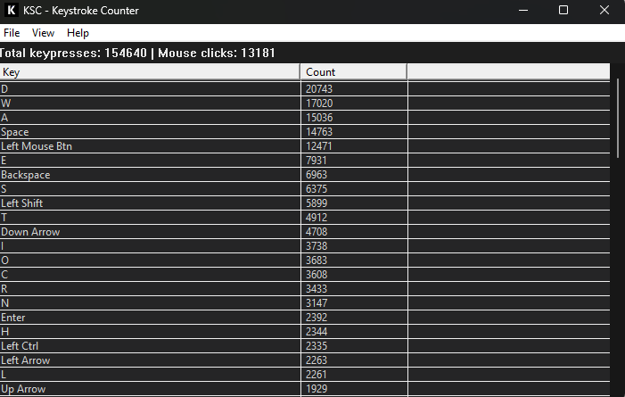
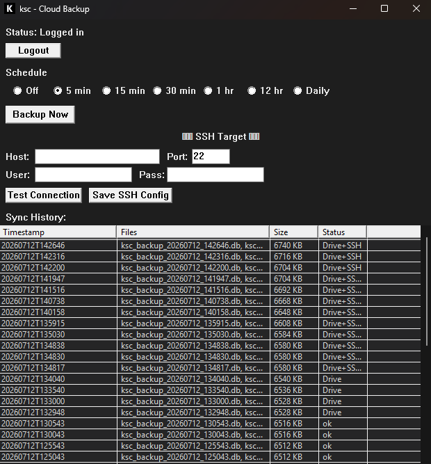
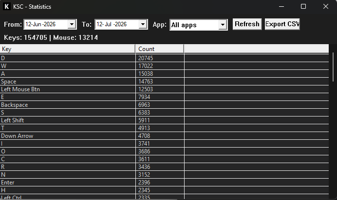
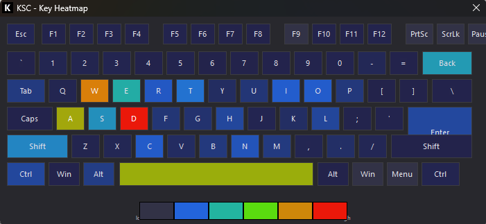
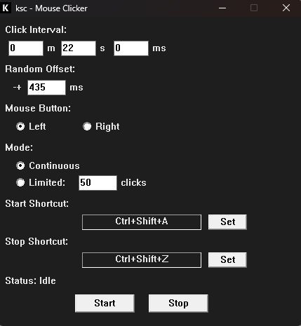
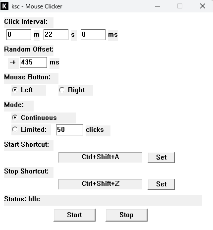
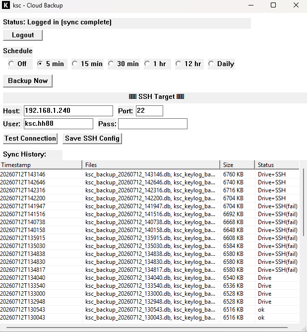

# ⌨️ ksc — Keystroke Counter

**v1.1** — Lightweight Windows desktop app (~6.5k LOC) in modern C that counts keystrokes, tracks per-app usage, simulates keyboard input, syncs encrypted backups to Google Drive and SSH, and sends Telegram notifications.

## 📸 Screenshots

| 🌙 Dark Mode | |
|---|---|
|  |  |
|  |  |
|  | |

| ☀️ Light Mode | |
|---|---|
|  |  |

## ✨ Features

### 📊 Core
- **Keystroke & mouse tracking** — Low-level keyboard + mouse hooks capture every keypress and left/right click system-wide
- **Per‑app tracking** — Records which app received each keypress via foreground window title
- **Live totals** — Keyboard keypresses vs mouse clicks, separated and auto-updating
- **Batch writes** — Ring buffer + writer threads flush DB in transactions

### 🪟 Windows & Views
- **Heatmap** — Full QWERTY layout + numpad + arrows colored by usage frequency (blue → red), tooltips on hover, app filter
- **Statistics** — Date range pickers, app filter, keyboard/mouse totals, CSV export
- **Keylogger** — Timestamped per‑key recording to a separate database; own viewer window
- **Mouse clicker** — Min/sec/ms interval, random offset, left/right button, continuous/limited, system‑wide hotkeys
- **Keyboard simulator** — Record key combos, replay with configurable interval, system‑wide start/stop hotkeys

### 🔔 Notifications
- **Telegram** — Bot token + group chat ID; sends sync status on success or failure only
- **Test button** in settings for end‑to‑end verification

### 🎨 UI
- **Dark mode** — Full dark theme (title bar, scrollbar, menus, all child windows)
- **System tray** — Minimize to tray; right‑click for show/heatmap/stats/clicker/keylogger/settings/quit
- **Tray tooltip** — Today's keypress count
- **Show/hide hotkey** — Configurable `Ctrl+Shift+K` to raise the window from anywhere

### ☁️ Cloud Backup
- **Google Drive** — OAuth2 login via browser, `ksc-backups` folder auto‑created in root
- **SSH / SFTP** — Upload to `~/ksc-backups`; host/port/user/password with DPAPI‑encrypted storage
- **Scheduler** — Off / 5 min / 15 min / 30 min / 1 h / 12 h / daily
- **Multi‑target** — Backups go to Drive, SSH, or both; local files deleted only after all targets succeed

### 🛠️ Data Management
- **Backup & Restore** — Timestamped local `.db` backups; restore with one click
- **CSV export** — All‑time or date‑filtered, per‑app breakdown
- **Reset statistics** — Wipe counts, keep settings
- **Single instance** — Mutex prevents duplicate processes

### 🔐 Build & Distribution
- **Static linking** — Standalone `.exe`, zero runtime DLLs
- **Self‑signed Authenticode** — One‑time trust command eliminates SmartScreen
- **VERSIONINFO** — File properties show version, company, product
- **Custom app icon** — Embedded `.ico` resource

## ⚙️ Settings

| Setting | Default | Description |
|---|---|---|
| Start with Windows | OFF | Launches ksc on login |
| Start minimized to tray | OFF | Starts hidden |
| Dark mode | OFF | Full dark theme |
| Auto‑refresh stats | ON | Every 10 seconds |
| Enable Keylogger | OFF | Records keystrokes to `ksc_keylog.db` |
| Reset All Statistics | — | Clears counts, keeps settings |
| Delete Keylogger Logs | — | Deletes keylogger database |
| Show KSC Shortcut | Ctrl+Shift+K | System‑wide hotkey |
| Enable Telegram | OFF | Sends sync status to Telegram group |
| Bot Token / Chat ID | — | Telegram bot credentials |
| Notify mode | All | Success+failures or failures only |
| Test Message | — | Sends a test message to the group |

All settings stored in SQLite.

## 🚀 Quick Start

```powershell
.\build.ps1
```

Requires CMake 3.15+, GCC (MinGW‑w64), and OpenSSL for SSH support. The script downloads SQLite, builds libssh2 (OpenSSL backend), compiles everything, signs the `.exe`, and prints the trust command.

To eliminate SmartScreen warnings (run once as Admin):
```powershell
Import-Certificate -FilePath .\ksc.cer -CertStoreLocation Cert:\CurrentUser\TrustedPublisher
```

## 🧱 Tech Stack

| Layer | Choice |
|---|---|
| Language | C11 |
| Compiler | GCC (MinGW‑w64) |
| Build | CMake |
| Database | SQLite3 (amalgamation) |
| HTTP | WinHTTP |
| SSH | libssh2 + OpenSSL |
| Crypto | DPAPI, CryptGenRandom, BCrypt |
| UI | Win32 |
| Linking | Fully static |

## 🗺️ Future Plans

- Idle detection & session tracking
- Portable mode (store DBs alongside `.exe`)
- Typing speed display (live WPM)
- Linux support (X11/Wayland)

## 📄 License

MIT — feel free to use and modify.

---

Built with ❤️ for Windows 11
