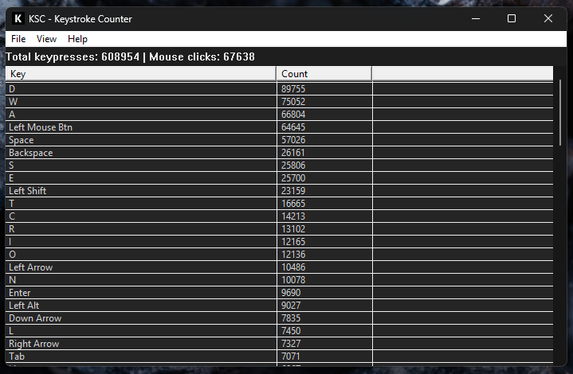
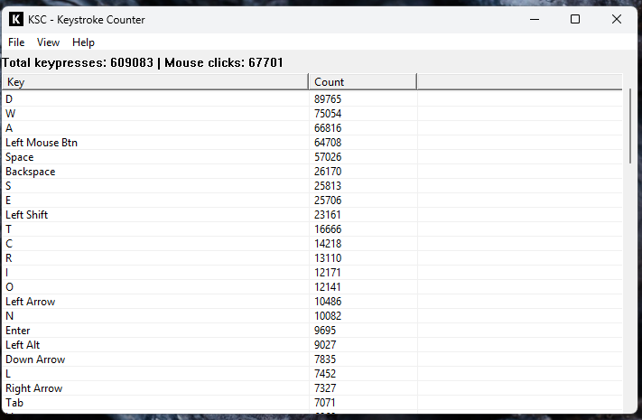
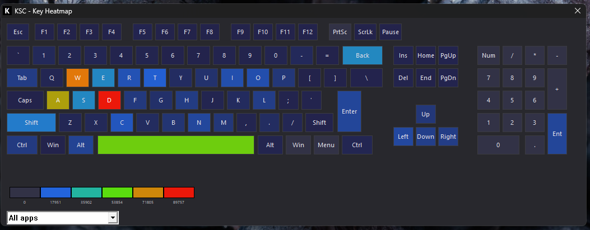
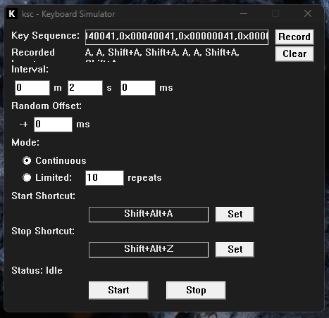
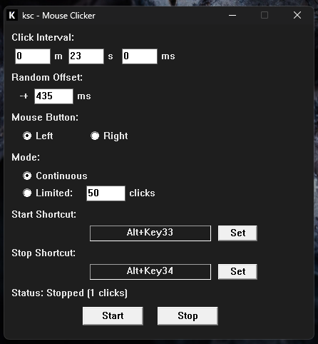
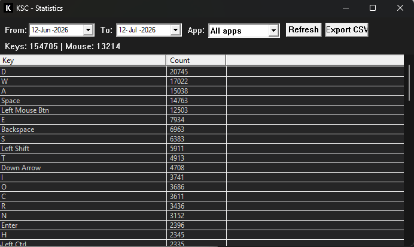
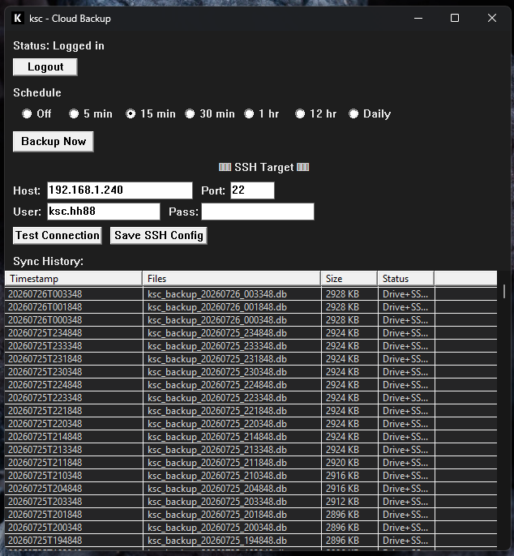

# ⌨️ ksc — Keystroke Counter

**v1.1** — A lightweight Windows desktop app in modern C (~6.5k LOC) that tracks every keystroke, maps keyboard heatmaps, simulates input, records to a keylogger, and syncs encrypted backups to Google Drive and SSH with Telegram notifications.

<p align="center">
  
  
</p>

---

## 📸 Screenshots

| 🌙 Dark Mode | |
|---|---|
|  |  |
|  |  |
|  | |

---

## ✨ Features

### ⌨️ Core Tracking
- **Keystroke & mouse counting** — Low-level hooks (`WH_KEYBOARD_LL` + `WH_MOUSE_LL`) capture every keypress and left/right click system‑wide
- **Per‑app tracking** — Records which foreground window received each event
- **Live totals** — Keyboard keypresses vs mouse clicks, separated and auto‑updating
- **Batch writes** — Ring buffer + writer threads flush in `BEGIN/COMMIT` transactions per ~100ms

### 🪟 Windows & Views
- **Keyboard heatmap** — Full QWERTY + numpad + arrow keys colored by usage frequency (blue → red gradient), tooltips on hover, per‑app filter, double‑buffered rendering
- **Statistics** — Custom date range pickers, app filter, keyboard/mouse separated totals, 10s auto‑refresh, CSV export
- **Keylogger** — Timestamped per‑key recording to a separate `ksc_keylog.db`; dedicated viewer window with date + app filters
- **Mouse clicker** — Configurable click interval (min/sec/ms), random offset, left/right button, continuous/limited mode, system‑wide start/stop hotkeys
- **Keyboard simulator** — Record key combo sequences, replay with interval + random offset, system‑wide start/stop hotkeys

### ☁️ Cloud Backup
- **Google Drive** — OAuth2 login via browser, `ksc-backups` folder auto‑created in Drive root, DPAPI‑encrypted token storage
- **SSH / SFTP** — libssh2 with OpenSSL backend, uploads to `~/ksc-backups`, password encrypted with DPAPI
- **Scheduler** — Off / 5 min / 15 min / 30 min / 1 h / 12 h / daily
- **Multi‑target** — Backups go to Drive, SSH, or both; local files deleted only after ALL targets succeed
- **Safe online backup** — Uses `sqlite3_backup_init()` API (WAL‑safe) instead of raw file copy
- **WAL mode** — SQLite journal mode enabled for concurrent reads during writes

### 🔔 Notifications
- **Telegram** — Bot token + group chat ID; sends status after each sync (success + failures, or failures only)
- **Test message** button in Settings for end‑to‑end verification

### 🎨 UI
- **Dark mode** — Full dark theme: title bar, scrollbar, menus, list views, all child windows via `DwmSetWindowAttribute` + `AllowDarkModeForWindow`
- **System tray** — Minimize to tray on close; today's count in tooltip; right‑click for quick access
- **Show/hide hotkey** — Configurable `Ctrl+Shift+K` to raise the window from anywhere
- **Start minimized** — Launch directly to system tray
- **Start with Windows** — Registry Run key toggle

### 🛠️ Data Management
- **Safe backup & restore** — Online `.db` backup with `sqlite3_backup_init()`; one‑click restore
- **CSV export** — All‑time or date‑filtered, with per‑app breakdown
- **Reset statistics** — Wipe counts, keep settings
- **Single instance** — Named mutex prevents duplicate processes

### 🔐 Build & Distribution
- **Static linking** — Standalone `.exe` (zero DLL dependencies)
- **Self‑signed Authenticode** — Code‑signed with timestamp at build time; one‑time trust command eliminates SmartScreen
- **VERSIONINFO** — File properties show version `1.1`, company `bbounce.org`
- **5,200+ lines of hand‑written C11** — No frameworks, no external UI libs

---

## ⚙️ Settings

| Setting | Default | Description |
|---|---|---|
| Start with Windows | OFF | Launches ksc on login |
| Start minimized to tray | OFF | Starts hidden |
| Dark mode | OFF | Full dark theme |
| Auto‑refresh stats | ON | Every 10 seconds |
| Enable Keylogger | OFF | Records to `ksc_keylog.db` |
| Reset All Statistics | — | Clears counts, keeps settings |
| Delete Keylogger Logs | — | Deletes keylogger database (disabled while keylogger on) |
| Show KSC Shortcut | `Ctrl+Shift+K` | Configurable system‑wide |
| Telegram Bot Token | — | From @BotFather |
| Group Chat ID | — | Telegram group ID |
| Enable Telegram | OFF | Sends sync status |
| Notify mode | All | Success + failures, or failures only |

All settings stored in SQLite.

---

## 🚀 Quick Start

```powershell
.\build.ps1
```

Requires **CMake 3.15+**, **GCC (MinGW‑w64)**, and **OpenSSL** (for SSH). The script:
1. Downloads SQLite3 amalgamation + libssh2 source
2. Builds libssh2 (OpenSSL backend)
3. Generates the app icon
4. Compiles everything with static linking
5. Self‑signs the `.exe`

To eliminate SmartScreen warnings (run once as Admin):
```powershell
Import-Certificate -FilePath .\ksc.cer -CertStoreLocation Cert:\CurrentUser\TrustedPublisher
```

---

## 🧱 Tech Stack

| Layer | Choice |
|---|---|
| Language | C11 |
| Compiler | GCC (MinGW‑w64) |
| Build | CMake |
| Database | SQLite3 (amalgamation, WAL mode) |
| HTTP | WinHTTP |
| SSH | libssh2 + OpenSSL |
| Crypto | DPAPI, CryptGenRandom, BCrypt |
| UI | Win32 API |
| Linking | Fully static |

---

## 🗺️ Future Plans

- Idle detection & session tracking
- Portable mode (store DBs alongside `.exe`)
- Typing speed display (live WPM)
- Linux support (X11/Wayland)

---

## 📄 License

MIT — feel free to use and modify.

---

Built with ❤️ for Windows 11
